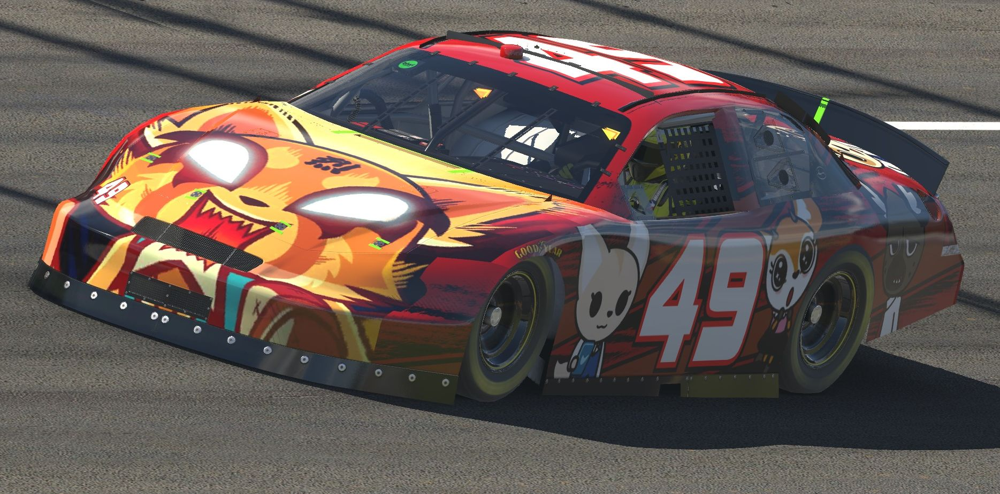

# Projexture

Projexture is a tool used to "reverse-engineer" a UV map for a 3D model that you don't really have access to. It was specifically created to help with livery painting in iRacing, where you may change the texture file on disk and have it quickly update in-game. The template files provided by iRacing are extremely helpful in producing liveries, but some cars have particularly difficult UV maps to paint over, requiring a ton of time spent manually cutting up images and lining up textures over seams in the image.

It is still very much a work in progress, but is functional enough to use at this point. Take a look at the [tutorial](https://github.com/zzm634/projexture/tree/master/tutorial) for instructions on basic usage of the program.

Future updates may include:
- Manually cropping projection maps after scanning
- Position, scale, and rotate overlay images before projecting
- Better "fill holes" algorithms for post-projection processing
- Projecting overlays onto existing textures
