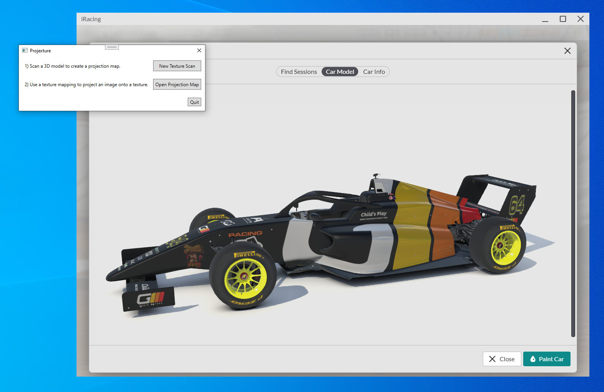
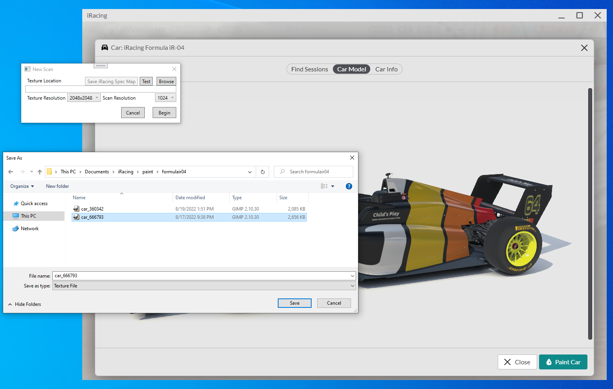
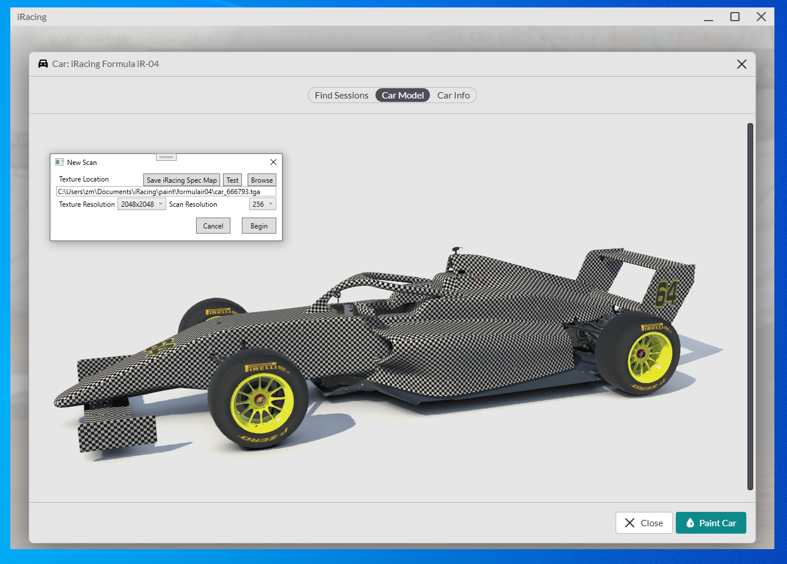
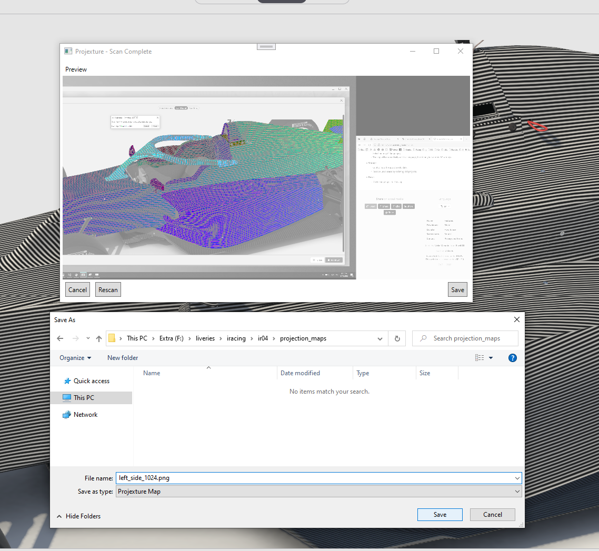
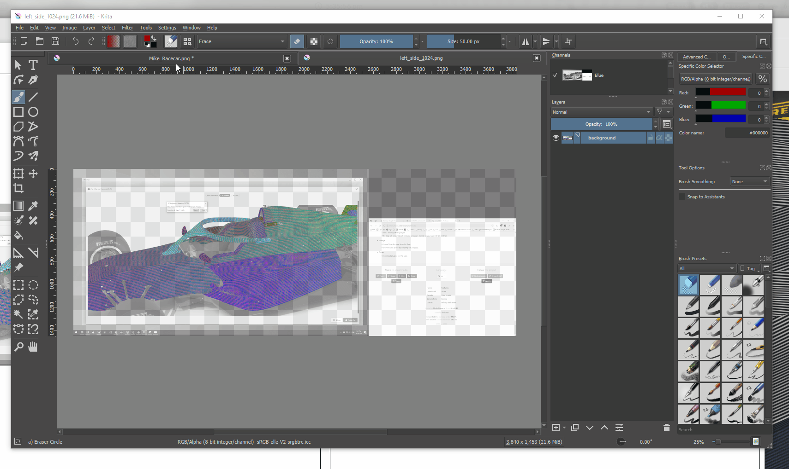
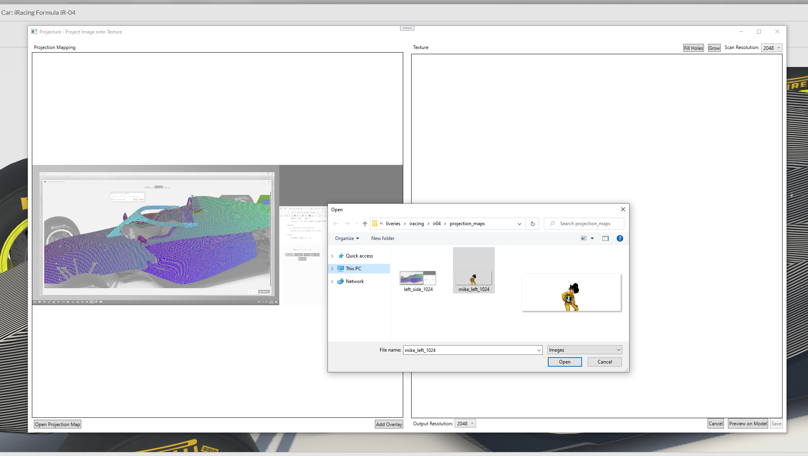
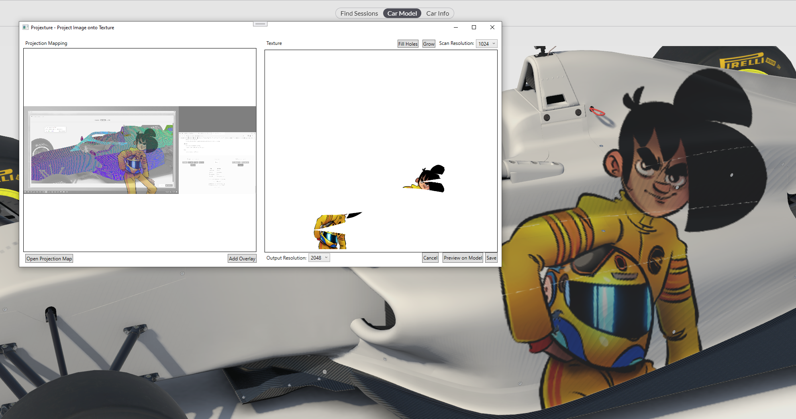
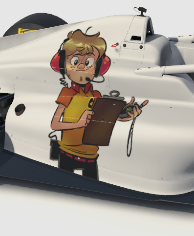

# Using Projexture to create car textures

Projexture is designed to use the iRacing model viewer to help you reverse-engineer the placement of images onto a car model.

Projecting an image onto a 3D model in Projexture is a three step process: scanning the model to create a map, painting over the map with your image, and using the map and image together to create a texture. It works by taking screenshots of the model with unique black-and-white patterns that allow it to precisely determine where each pixel in the texture file is drawn on the 3D image.

In this tutorial, we're going to paint a lovely picture of Mike Racecar onto the side of this Formula iR-04.

## Scanning a Model to create a Projection Map

From the main window, click on "New Texture Scan" to begin scanning a 3D model. A new window will appear that allows you to customize the parameters of your scan.

Click "Browse" and locate the texture file that corresponds to the car you are trying to paint. You can find it under "My Documents\iRacing\paint". Locate the folder containing paint files for the car and select or create the texture file for your car. It should have the name "car_#####.tga" where the number corresponds to your iRacing customer number.

Once you've located the file, position the iRacing window and car model in such a way to maximize the area on screen that you plan on painting. You want to zoom in as much as possible for the most detail. You may click "test" to put a checkerboard pattern on the car at the specified scan resolution. The clearer the pattern is, the better the scan will be. You may need to reduce the scan resolution for a better result, though this will result in a blockier final image.

The key here is to play with the iRacing window bounds to maximize the resolution. Use multiple monitors if you have them; or use nVidia's "super resolution" feature to get even more detail in the image.

You may also click "Save iRacing Spec Map" to load a specular map onto the car that will aid in the scanning process by eliminating glare.

Once you've got everything positioned correctly, click "Begin" to start scanning. *Do not move the iRacing window or reposition the camera until you have fully scanned the car.*

 A new window will pop up and the car will be painted completely black for the first image. Once the iRacing window completes rendering the new texture, click the "Next" button, and it will be re-painted white for the second image. The car will be painted with various black-and-white patterns increasing in resolution until the scan is complete. Just keep waiting for the image to change and clicking the "Next" button to capture all the images.

**Scanning is not an automatic process. You have to keep clicking "Next".**

When the scan is complete, you will have a chance to preview the scanned area. Colored parts of the image indicate areas that have been successfully mapped to positions on the texture file, while greyscale pixels are for un-mapped areas. If you're happy with the scan, click "Save" to save the projection map to disk. Save it somewhere you may easily access it, because you're going to need to open it up right away.

## Painting an Overlay Image for a Projection Map

Once you have made a projection map for a car, you may project images onto the areas you have scanned. In a future version of Projexture, it will be possible to position, rotate, and crop images directly on top of the scanned projection map, but for now, it's necessary to use an external editor like Photoshop, GIMP, or Krita to create your overlay image.

Projection maps can be reused as many times as you like. If you need to restart Projexture, in the incredibly likely event that it crashes, you can skip to this step by clicking "Open Projection Map" on the starting screen.

Open the projection map you created (it's just a PNG) in the editor of your choosing, preferably one that supports layers. In this example, I am using Krita. In a new layer, add your images or paint over the areas of the car you want to project onto. The overlay image must be the same dimensions as your projection map, and should be in a format that supports transparency, such as PNG. Delete, or hide the original projection map layer and export your overlay image to a file.

Back in the Projexture window, click "Add Overlay" and locate the overlay image you just created. The overlay image will be projected onto the texture area on the right using the information contained in the projection map on the left.

Once your projection is created, you may make small fixes and adjustments using the "Fix Holes" and "Grow" buttons to attemp to fill in any gaps in the scan. Not everything can be fixed, and some manual fiddling may be necessary. Make sure the "Scan Resolution" in the top right is set to the same value of your original scan!

If you got here from a fresh scan, you may click "Preview on Model" to save the projection to the car and see how it looks in practice. If you like the result, click "Save" to export the final projection mapping. Add this as a layer to your livery editor of choice, and you're off to the races!

Happy Projexting!

