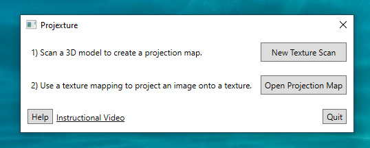
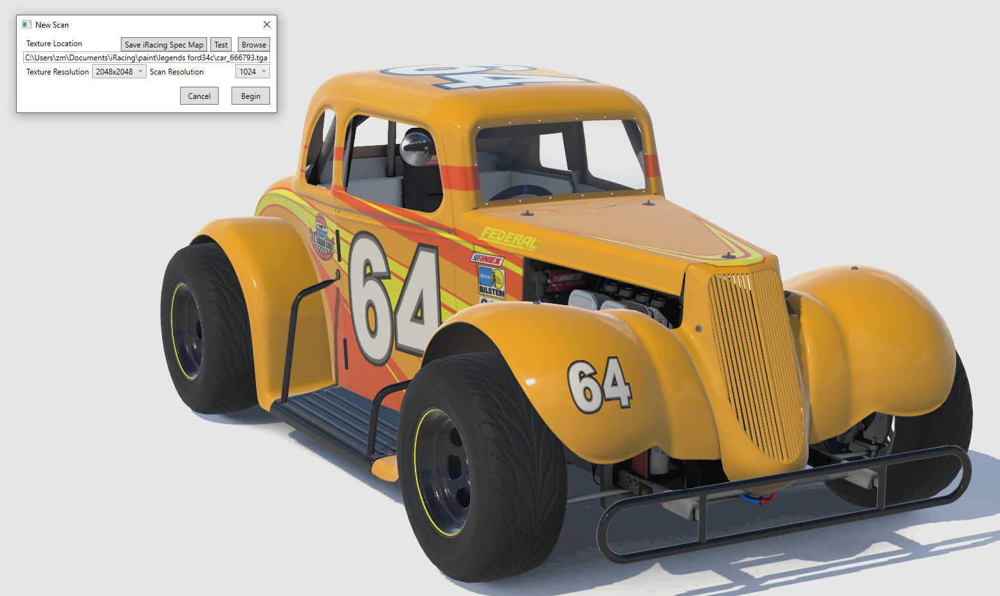
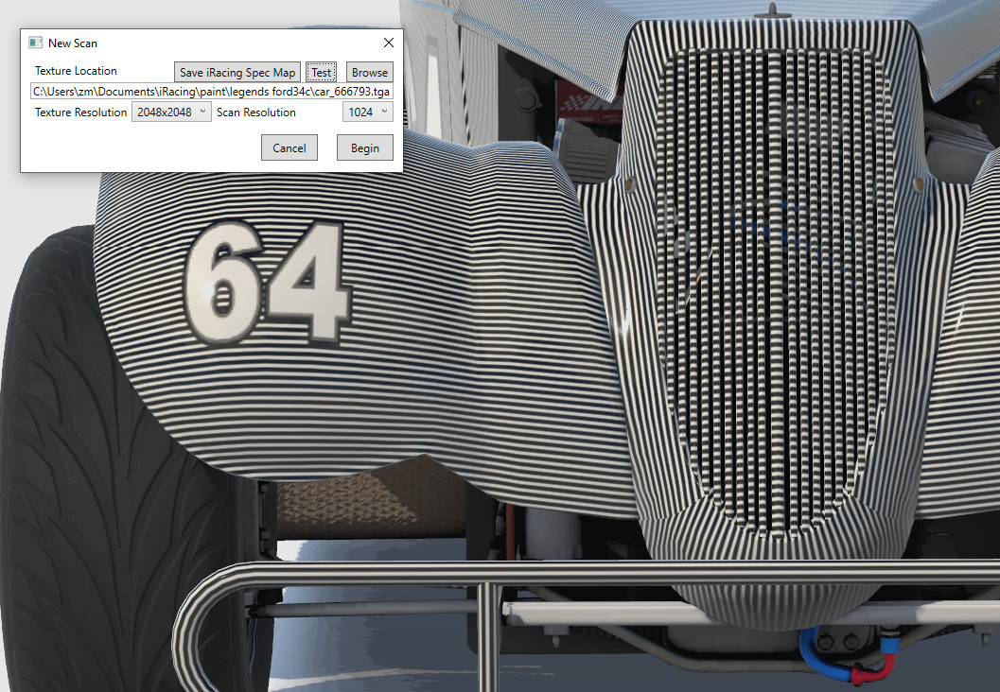
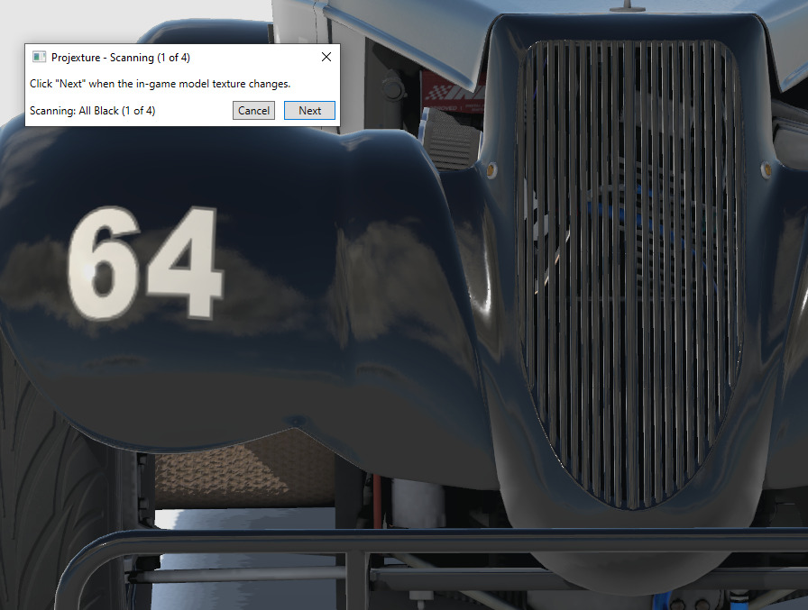
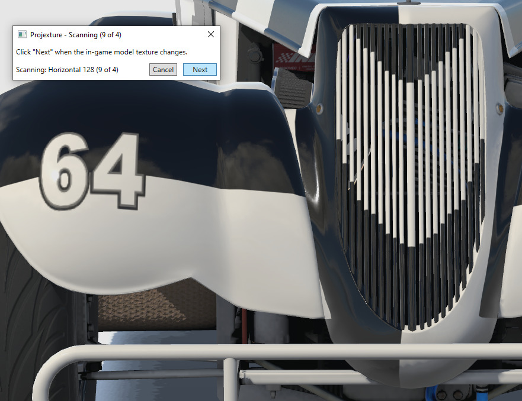
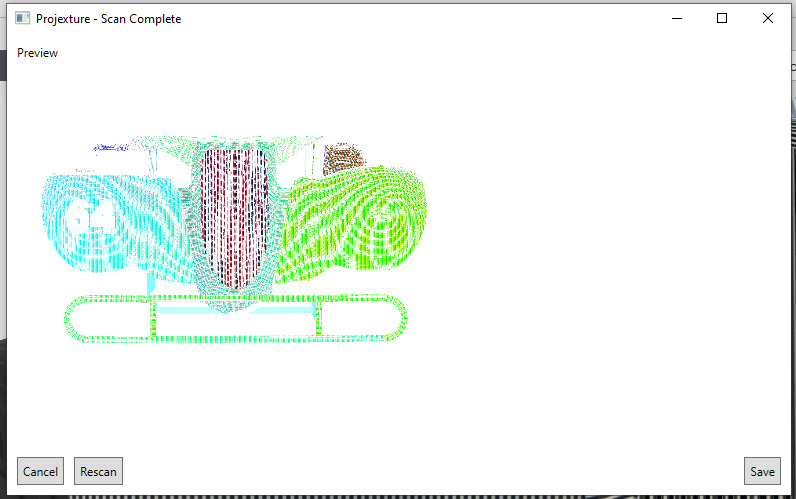
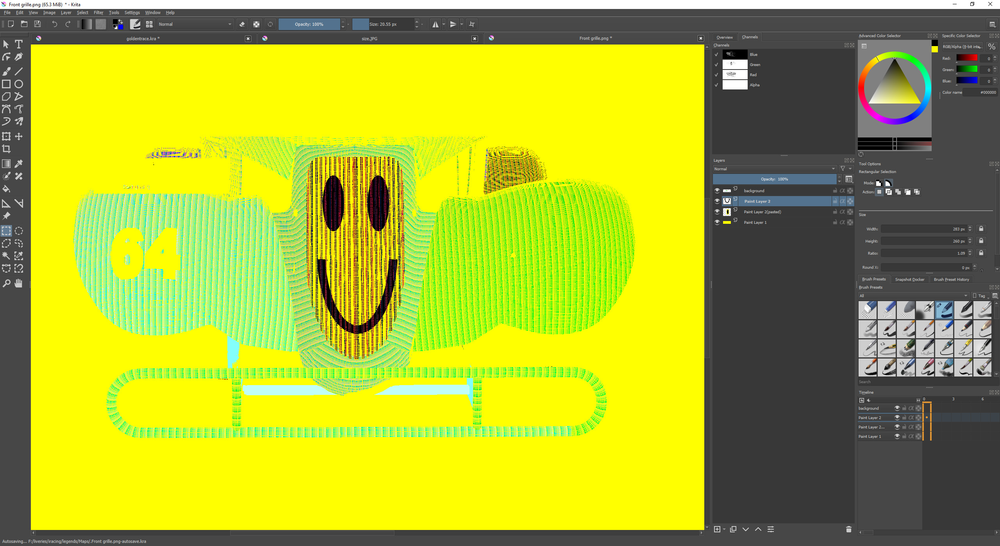
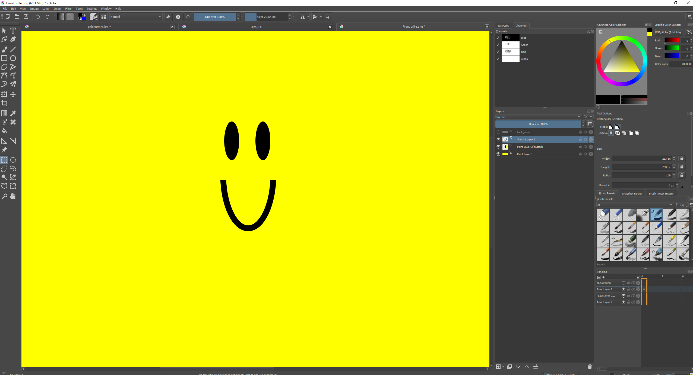
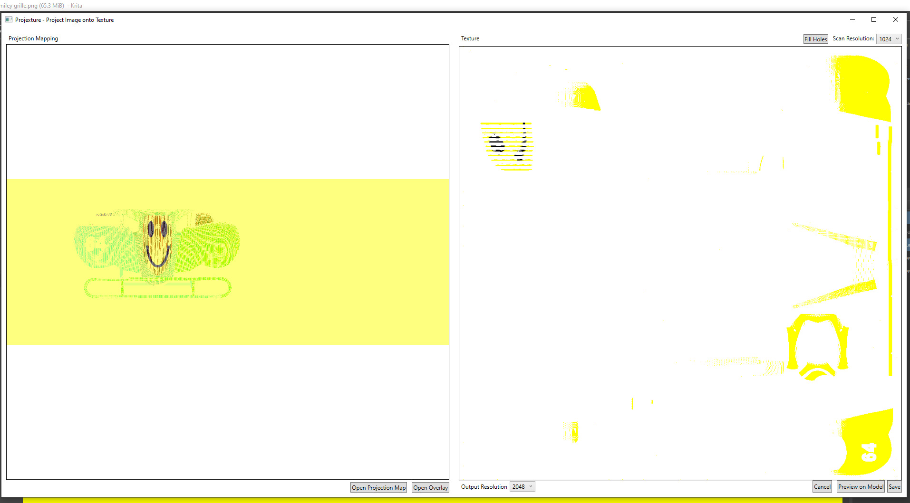
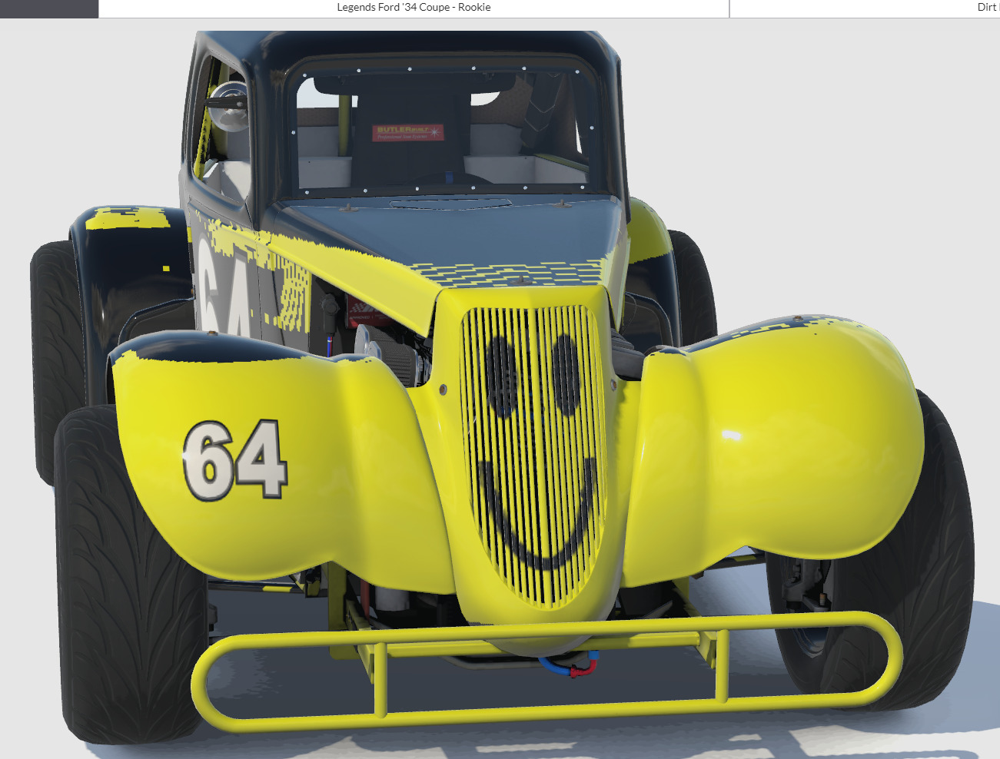

# Using Projexture to create car textures

Projecting an image onto a 3D model in Projexture is a three step process: scanning the model to create a map, painting over the map with your image, and using the map and image together to create a texture. It works by taking screenshots of the model with unique black-and-white textures that allow it to precisely determine where each pixel in the texture file is drawn on the 3D image.

## Scanning a Model to create a Projection Map

From the main window, click on "New Texture Scan" to begin scanning a 3D model. A new window will appear that allows you to customize the parameters of your scan.

From this window, you must first locate the texture file on disk that corresponds to the 3D model you wish to scan. Click "Browse" to locate the file. After that, you may click "Test" to save a test texture to disk to ensure that you have the correct file.

Position the 3D model such that you're soomed in as far as possible on the area you want to scan. In this case, we're trying to paint the grille on this car. Adjust the texture and scan resolution to be as high as possible, using the "Test" button to test your changes, such that the scan lines are still clearly distinct from each other.

The texture resolution determines the size of the texture file used, and should be as large as the game can display, while the scan resolution determines how precise the scan process will be. If the scan resolution is too high, the scan lines will blur together and Projexture will be unable to map those blurry areas (resulting in "holes" in the projection later on). If the scan resolution is too low, the projection will be "blocky" and the projection will have a lower image quality.

Once you're happy with the resolution and the position of the model, click "Begin" to start scanning. It is critically important that the position and orientation of the 3D model on screen does not change until the scan process is complete.

The texture file of the 3D model will now be overwritten with various black and white patterns used to scan the paintable area of the 3D model. First, a fully-black and fully-white image will be taken of the car, followed by a series of increasingly fine horizontal and vertical stripes.

Position the "scan" window on screen in a place that does not obscure the parts of the model you want to paint, and click the "next" button every time the model's texture changes on screen. If a spec map is being used, be sure to wait until the spec map is applied as well.

Once the scan is complete, a preview window will open to show which pixels of the screenshot have been successfully mapped to the car. Click "Save" to save this mapping file to disk and begin the projection process.

## Painting an Overlay Image for a Projection Map

In a later version of Projexture, it will be possible to position, rotate, and crop images directly on top of the scanned projection map, but for now, it's necessary to use external editors to create your overlay image.

The overlay image must be exactly the same dimensions as the projection map, so the easiest solution is to open up the projection map file you saved in the previous step in your image editor of choice, and draw on top of it in a new layer.

In this instance, we're trying to draw a smiley face on the grille of this car. Be sure to save the overlay image without the projection map layer on top of it

## Projecting an Overlay Image to create a Texture

Back in Projexture, load the overlay image you just created by clicking "Open Overlay". The image you created on the left will be "projected" into the texture on the right. Adjust the scan resolution if necessary to match the original scan, or set it lower if there are too many gaps in the result. You can also click "Fill Holes" to try and fill in pixel-wide gaps in the texture.

Finally, you may click "Preview on Model" to see what this projection looks like in-game, or click "Save" to save your projection as a transparent PNG, to use as a layer in another file.

It may take a few tries to get a projection perfect, so good luck and happy projexting!